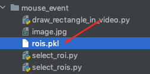

## 前言

写了一个简单完整的小程序，交互式选取视频中的多个ROI并能进行保存，方便后续项目开发，本程序是完全可以运行的。

## 使用方法

打开终端，安装opencv-python

```bash
pip install opencv-python
```

源程序

```python
"""
从视频中选取多个的ROI
Author：QiangZiBro
	
Github：https://github.com/QiangZiBro
EMAIL：qiangzibro@gmail.com
"""
import os
import cv2
import pickle


class ROISelector(object):
    def __init__(self, camera=cv2.VideoCapture(0)):
        self.camera = camera
        self.ROIs = []
        self.update()

    def update(self):
        while True:
            if self.camera.isOpened():
                (self.status, self.frame) = self.camera.read()
                self._draw_ROIs()
                cv2.imshow('image', self.frame)
                key = cv2.waitKey(2)

                if key == ord('r'):
                    self._select_roi()
                if key == ord('q'):
                    break
                elif key == ord('p'):
                    self.ROIs.pop()
                elif key == ord('l'):
                    self._load_roi_as_pkl()
                elif key == ord('s'):
                    self._save_roi_as_pkl()

    def _select_roi(self):
        while True:
            key = cv2.waitKey(500)
            if key == ord('q'):
                break
            ROI = cv2.selectROI("image", self.frame, showCrosshair=False, fromCenter=False)
            self.ROIs.append(ROI)
            self._draw_ROIs()
            cv2.imshow('image', self.frame)

    def _draw_ROIs(self):
        if self.ROIs:
            for ROI in self.ROIs:
                x, y, w, h = ROI
                cv2.rectangle(self.frame, (x, y), (x + w, y + h), color=(255, 255, 0), thickness=2)

    def _save_roi_as_pkl(self, name="rois.pkl"):
        with open(name, "wb") as f:
            pickle.dump(self.ROIs, f)

    def _load_roi_as_pkl(self, name="rois.pkl"):
        if os.path.exists(name):
            with open(name, "rb") as f:
                self.ROIs = pickle.load(f)


if __name__ == '__main__':
    static_ROI = ROISelector()
    cv2.destroyAllWindows()
```

直接上面这个程序，按键对应的功能：

```
r：进入选取ROI模式，选取ROI模式内
    - （1）唯一退出方法：0.5秒以内按q快速退出（本程序还不能任意时刻按q都能退出）
    - （2）开始选取ROI：等待0.5秒以上或者按其它键，使用鼠标点击移动可以选取ROI

l: 加载可能的ROI文件
s：保存当前矩形框为 rois.pkl
p: 删除最后一个ROI
q：退出
```


使用示例

按c，鼠标左键单击后不放，移动显示一个矩形，松开，出来一个矩形框


按空格，则确定候选框并记录下来。接着可以退出选取ROI，注意如果需要退出请快速按q退出选取阶段。如果想进行下一个ROI选取，可以按其它键或者等待0.5秒再按键。


使用类似方法可以完成多个矩形框选取


退出ROI选择模式后，可以按s保存选取的候选框，在代码运行的目录下，会出现`rois.pkl`文件



按p删除上一个框


如果文件存在，下次运行，按l可以直接加载之。


## 总结

- 应用设计模式

类初始化时可以传进不同的视频读取对象，比如说可以传一个kinect对象，注意这个对象也需要按照opencv读取视频的方法来实现`.isOpened()`和`.read()`两种方法，用代码表示为：

```python
class Camera:
  def __init__(self, **kargs):
    pass
  
  def isOpened(self):
    pass
  
  def read(self):
    """获取读取状态和图片"""
    pass
```

- 如何调用这个类？

```python
camera=cv2.VideoCapture(0)

ROIs =  ROISelector(camera).ROIs
# 做一些其它的工作...
detect(ROIs, camera)
```


- 仍有优化的空间

也许你有更好的点子，欢迎提出来分享~